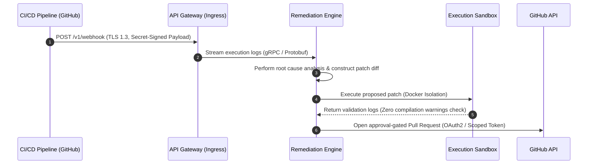

<div align="center">

# CRLabs

**SYSTEMS ENGINEERING & APPLIED AI INFRASTRUCTURE**

```text
Status: Active Development & Architecture
Focus: Deterministic Agent Runtimes · LLM Orchestration · Resilient Infrastructure
```

</div>

CRLabs is a software engineering organization building resilient systems at the intersection of applied artificial intelligence, distributed platforms, and cloud infrastructure. We research, design, build, and operate production-grade software. We do not build prototypes for demonstration; we build robust, observable systems.

---

## Areas of Focus

We design and maintain software across three core technology pillars:

*   **Applied AI & Agentic Runtimes:** Deterministic agent loops, runtime orchestration, and closed-loop validation sandboxes.
*   **Distributed Systems & Storage:** High-throughput backend platforms, transaction processing engines, and vector indexing topologies.
*   **Developer Platforms & Cloud Infrastructure:** Automated validation pipelines, infrastructure-as-code deployments, and scoped API integration gateways.

---

## The Product Ecosystem

We maintain a decoupled, specialized repository topology where each module has strict domain boundaries and specific verification requirements.

### Active Projects & Platforms

*   **Akesis** (Active Development)
    *   *Role:* AI-powered CI/CD remediation platform.
    *   *Function:* Streams execution logs, conducts root cause analysis, generates safe unified patches, and validates changes inside isolated docker environments.
*   **GestureOS** (Planned)
    *   *Role:* Multimodal human-computer interaction platform running edge-based computer vision runtimes.

### Repository Topography

To navigate our codebase, we maintain a modular, standardized directory layout:

| Repository | Domain | Core Verification Gate |
| :--- | :--- | :--- |
| **[engineering](https://github.com/crlabs-ai/engineering)** | Playbook & Standards | Automated link integrity and markdown lint checking. |
| **[research](https://github.com/crlabs-ai/research)** | Applied AI Evaluations | Peer architect review on model evaluation methodologies. |
| **[infrastructure](https://github.com/crlabs-ai/infrastructure)** | IaC & Networking | Static plan validation (`terraform validate`) and dry-run linting. |
| **[shared-libraries](https://github.com/crlabs-ai/shared-libraries)** | Reusable Code Blocks | Semantic version enforcement and backward-compatibility gates. |

---

## Operating Philosophy

Our engineering execution follows a linear lifecycle. We believe that software must be understood, designed, and documented before the first line of code is written.

```text
[Research] ──(RFC)──> [Requirements (PRD)] ──(HLD/LLD)──> [Deterministic Build] ──> [Telemetry/Ops]
```

*   **Design Before Code:** Implementations are never rushed. Every major change requires a written design document (PRD/HLD) and peer architectural consensus before code is staged.
*   **Zero-Drift Branching:** We run trunk-based development with short-lived feature branches (<72 hours). Direct pushes to `main` are blocked.
*   **Design for Failure:** We assume that networks, databases, and LLM providers are inherently unreliable. We enforce timeouts, circuit breakers, and fallback pathways at the design layer.
*   **Telemetry as a Deploy Gate:** Code is not complete until it is fully observable. Tracing, structured JSON logs, and alert metrics are standard deployment prerequisites.

---

## System Engineering: Akesis Architecture

To illustrate our system standards, the following diagram maps the closed-loop data path of the **Akesis** pipeline:



*Alternative Text Description: The Akesis closed-loop pipeline begins with a failed CI/CD workflow sending a secret-signed HTTPS POST request to our API Gateway. Logs are streamed to the Remediation Engine via gRPC. The engine conducts analysis, generates a patch diff, and executes it inside an isolated Docker sandbox. Once verified with zero warnings, the engine invokes the GitHub API via OAuth2 to submit an approval-gated Pull Request.*

---

## Operational Specifications & Quality Gates

Every code modification must pass our automated quality gates and satisfy our 12 engineering pillars before staging and deployment:

| Pillar | Technical Standard | Verification Gate |
| :--- | :--- | :--- |
| **Design for Failure** | Circuit breakers, timeouts, and fallbacks. | Design document (HLD) must outline failure modes for all integrations. |
| **Observability** | Correlation IDs, trace propagation, structured JSON logs. | Code review check; verify metric registration and alert triggers. |
| **Documentation** | Version-controlled technical specifications. | Pull request review; all public API modifications require matching doc updates. |
| **Least Privilege** | Restricted execution contexts, database users, and IAM roles. | Automated policy analysis; secrets must reside in secure vault environments. |
| **API Stability** | Versioned endpoint routing (`/v1`, `/v2`). | Automated API contract compatibility checking. |
| **Backward Compatibility** | Expand-and-contract phase database migration patterns. | Database schema changes require migration review and lock-free execution plan. |
| **Testing** | Unit, integration, and end-to-end suites. | CI workflow execution; minimum coverage requirements apply. |
| **Performance** | Non-blocking execution loops, indexed database structures. | Load profile runs and resource leak analysis during staging. |
| **Scalability** | Horizontal scaling targets, queue-driven processing. | Scaling capacity analysis in High-Level Design reviews. |
| **Security** | Input sanitization, data encryption, dependencies audit. | SAST (Static Application Security Testing) pipeline checks. |
| **Maintainability** | Monorepo modularization, Conventional Commits 1.0.0. | Automatic commit linting and code complexity thresholds check. |
| **Developer Experience** | Clean terminal CLI environments, self-documenting setups. | Out-of-the-box local setup execution tests. |

---

## Technical Stack Specification

Our technology selection is optimized for latency, type safety, and transactional consistency:

| Layer | Selection | Rationale |
| :--- | :--- | :--- |
| **Systems & Runtimes** | Go · Rust · Python (FastAPI) | High-performance compiled runtimes paired with robust, async API environments. |
| **Persistence & Cache** | PostgreSQL · Redis | ACID-compliant transaction engine paired with low-latency memory caching. |
| **Vector Engine** | pgvector · Qdrant | Native SQL vector indexing alongside dedicated high-scale retrieval pipelines. |
| **State Orchestration** | LangGraph · Custom State Machines | State-machine-based agent orchestration guaranteeing deterministic outputs. |
| **Operations** | Docker · Kubernetes · AWS | Standardized containerization and automated verification setups. |

---

## Developer Experience (DX) & Verification

To interact with our local developer daemon or query service health, developers can leverage our command-line interfaces:

```bash
# Query global API gateway health status
curl -s -H "Accept: application/json" https://api.crlabs.ai/health

# Initialize local workspace validation daemon (Akesis CLI)
npx @crlabs/cli@latest init --workspace ./
```

### Pull Request Rules
All pull requests must pass automated pipeline checks before peer merge approval:
*   **Commit Style:** Messages must follow Conventional Commits 1.0.0 (e.g., `feat(parser): add stack trace extractor`).
*   **Static Analysis:** Lint checks must pass with zero issues (verified by automated workflow runs).
*   **Licensing Policy:** Core libraries use MIT/Apache 2.0 dual licenses. Core engines use Business Source License (BSL 1.1) to protect proprietary assets.

---
<div align="center">
  <sub><strong>CRLabs</strong> · Systems Thinking · Technical Rigor</sub>
</div>
