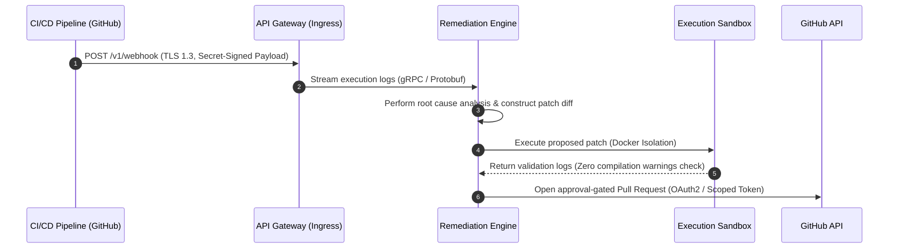

# CRLabs AI

<div align="left">
  <p><strong>Technical Specifications · Systems Engineering · Applied AI Infrastructure</strong></p>
</div>

| Attribute | Specification |
| :--- | :--- |
| **Organization** | github.com/crlabs-ai |
| **Status** | Actively Architecting & Building |
| **Core Domains** | Applied AI Systems · Distributed Platforms · Developer Tools |
| **Engineering Focus** | Deterministic Agent Runtimes · LLM Orchestration · Resilient Infrastructure |

---

## Operating Philosophy

We build software for production environments. We reject raw prototypes and demonstration hacks in favor of deterministic, observable systems. Every repository under CRLabs AI complies with this strict architectural lifecycle:

```text
[Research] ──(RFC)──> [Requirements (PRD)] ──(HLD/LLD)──> [Deterministic Build] ──> [Telemetry/Ops]
```

1.  **Architecture Before Code:** Implementations are never rushed. Every major change requires a written design document (PRD/HLD) and peer architectural consensus before code is staged.
2.  **Zero-Drift Branching:** We run trunk-based development with short-lived feature branches (<72 hours). Direct pushes to `main` are blocked.
3.  **Design for Failure:** We assume that networks, databases, and LLM providers are inherently unreliable. We enforce timeouts, circuit breakers, and fallback pathways at the design layer.
4.  **Telemetry as a Deploy Gate:** Code is not complete until it is fully observable. Tracing, structured JSON logs, and alert metrics are standard deployment prerequisites.

---

## Active Platform: Akesis

Akesis is our flagship AI-powered CI/CD remediation platform. It operates as a closed-loop system resolving failed execution runs in software pipelines.

### System Data Flow



*Alternative Text Description: The Akesis closed-loop pipeline begins with a failed CI/CD workflow sending a secret-signed HTTPS POST request to our API Gateway. Logs are streamed to the Remediation Engine via gRPC. The engine conducts analysis, generates a patch diff, and executes it inside an isolated Docker sandbox. Once verified with zero warnings, the engine invokes the GitHub API via OAuth2 to submit an approval-gated Pull Request.*

---

## Repository Specifications

Every repository within CRLabs AI adheres to this layout standard to ensure immediate navigation clarity and automated lint checking:

| Directory | Required Artifacts | Enforcement Rules |
| :--- | :--- | :--- |
| `docs/prd/` | Feature functional specification | Must define non-goals, functional boundaries, and quantitative success metrics. |
| `docs/hld/` | System/API topology specifications | Must include Mermaid sequence diagram, failure isolation parameters, and trade-off rationales. |
| `docs/adr/` | Architectural Decision Records | Immutable log. Decisions must document rejected alternatives and long-term tradeoffs. |
| `src/` | Executable source code | Must compile with zero warnings; 100% linter compliance required. |
| `tests/` | Unit, integration, and e2e suites | Code coverage requirements apply; required execution gate for all Pull Requests. |
| `.github/` | Workflows, templates, and CODEOWNERS | Explicit review routing and branch protection enforcement. |

---

## Technology Stack Specification

We select components based on architectural stability, scalability, and performance profile:

| Layer | Selection | Rationale |
| :--- | :--- | :--- |
| **Systems & Runtimes** | Go · Rust · Python (FastAPI) | High-performance compiled runtimes paired with robust, async API environments. |
| **Persistence & Cache** | PostgreSQL · Redis | ACID-compliant transaction engine paired with low-latency memory caching. |
| **Vector Engine** | pgvector · Qdrant | Native SQL vector indexing alongside dedicated high-scale retrieval pipelines. |
| **State Orchestration** | LangGraph · Custom State Machines | State-machine-based agent orchestration guaranteeing deterministic outputs. |
| **Infrastructure** | Docker · Kubernetes · AWS | Standardized containerization and automated verification setups. |

---

## Developer Experience (DX) & Verification

To interact with our local developer daemon or query service health, developers can leverage our command-line interfaces:

```bash
# Query global API gateway health status
curl -s -H "Accept: application/json" https://api.crlabs.ai/health

# Initialize local workspace validation daemon (Akesis CLI)
npx @crlabs/cli@latest init --workspace ./
```

### Pull Request Quality Gates
All pull requests must pass automated pipeline checks before peer merge approval:
*   **Conventional Commits:** Commit messages must follow Conventional Commits 1.0.0 (e.g., `feat(parser): add stack trace extractor`).
*   **Static Analysis:** Lint checks must pass with zero issues (verified by automated workflow runs).
*   **Database Migration Safety:** Database updates must run lock-free; API changes must be backwards-compatible.
*   **Security Gating:** Static Application Security Testing (SAST) must report zero vulnerabilities.
*   **Licensing Policy:** Core libraries use MIT/Apache 2.0 dual licenses. Core engines use Business Source License (BSL 1.1) to protect proprietary assets.

---
<div align="center">
  <sub><strong>CRLabs AI</strong> · Systems Thinking · Technical Rigor</sub>
</div>
